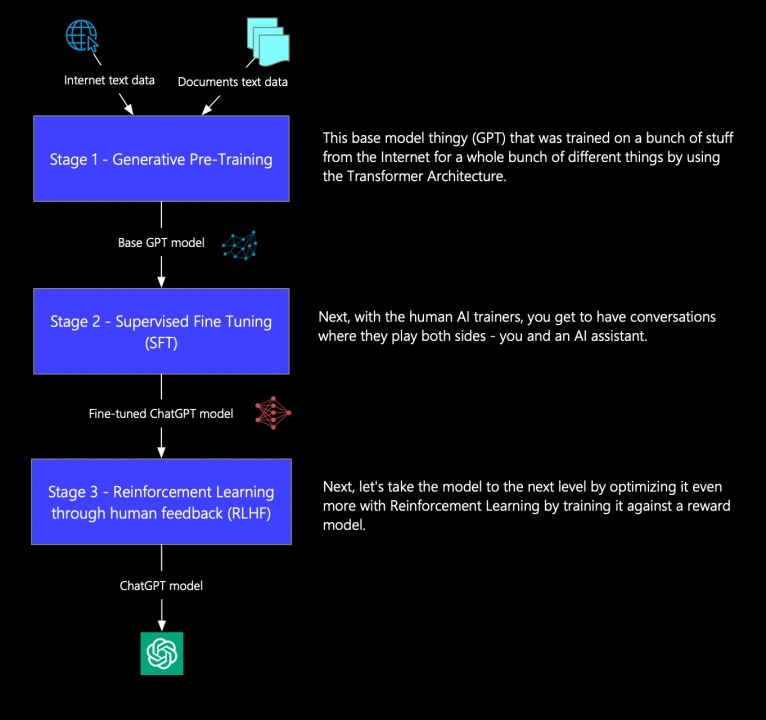
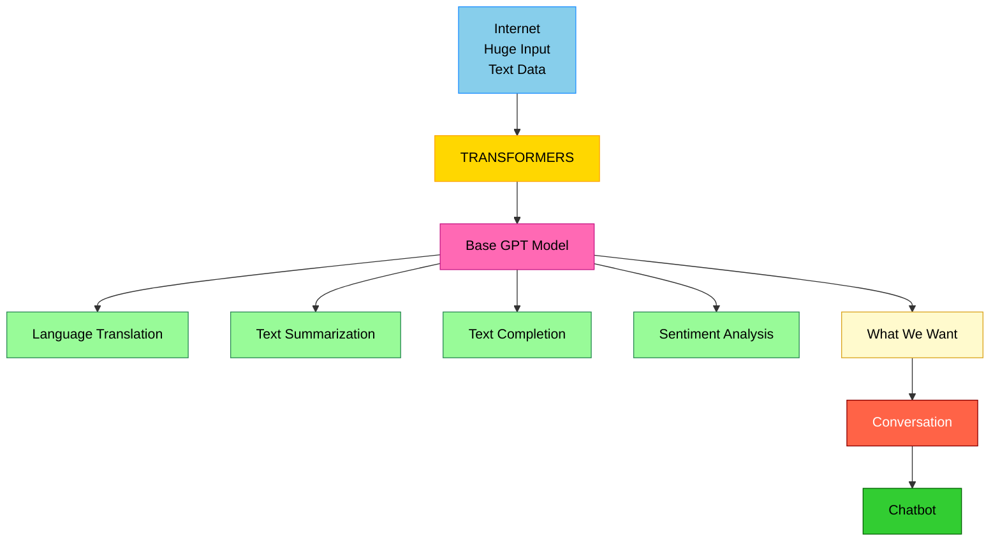
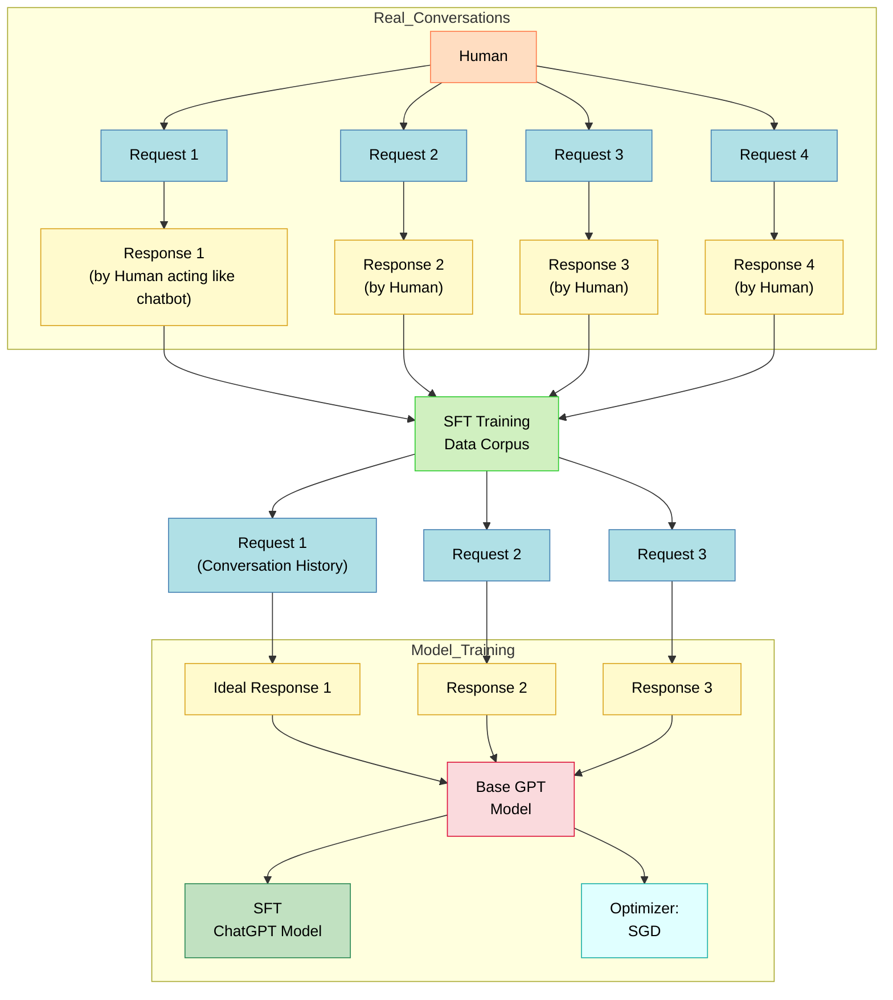

## **How ChatGPT is Trained**

### **Stage 1: Generative Pre-Training**

**Goal**: Teach the model to predict the next word in a sentence using large-scale data from the internet.

**Process**:

* ChatGPT is built on a Transformer-based architecture.
* It is first trained on a massive dataset of text from books, websites, and articles, covering diverse styles and topics.
* The model learns to generate coherent, contextually appropriate text by predicting the next token in a sequence — this is called **unsupervised learning**.

**Challenges**:

* This stage helps the model understand grammar, facts, and some reasoning.
* **However**, it is not aligned with what users expect from a chatbot (like having a conversation or answering specific instructions).
* It’s good at tasks like summarization, translation, and completion, but **not optimized for interactive, human-like dialogue**.

**Outcome**:

* Produces a generalized language model (the base GPT model).
* Still lacks the ability to align outputs with human intent or specific task requirements.

---

### **Stage 2: Supervised Fine-Tuning (SFT)**

**Goal**: Align the model closer to human expectations by teaching it how to respond in conversations.

**Process**:

1. **Human-generated conversations** are created where one human plays the chatbot and the other asks questions.
2. These conversations are converted into **input-output pairs** (prompt + ideal response).
3. The model is fine-tuned on these examples using **Stochastic Gradient Descent (SGD)** to update its parameters.

**Example Tasks Trained**:

* Q\&A
* Chatting
* Following instructions

**Challenges**:

* Still not perfect: After fine-tuning, the model often **drifts** (known as *distributional shift*). It may fail when facing situations outside the fine-tuning data.
* The model only imitates what it has seen — it doesn't evaluate responses for quality or intent.

**Outcome**:

* ChatGPT becomes much better at producing helpful, safe, and aligned responses.
* However, it still needs a mechanism to judge which responses are **best**, which leads to the next stage.

---

### **Stage 3: Reinforcement Learning with Human Feedback (RLHF)**

**Goal**: Refine the model using human preferences to make responses more helpful, safe, and aligned with user intent.

**Process**:

1. ChatGPT generates multiple responses to the same prompt.
2. **Human evaluators** rank these responses from best to worst.
3. A **Reward Model** is trained to assign higher scores to preferred responses using this ranking data.
4. Using **Proximal Policy Optimization (PPO)**, ChatGPT is further trained:

   * The **policy model** (ChatGPT) generates a response.
   * The **reward model** evaluates and scores it.
   * PPO uses these scores to fine-tune the model in small steps.

**Key Concepts**:

* **Reward function**: Based on human rankings; tells the model what’s “good”.
* **Goodhart’s Law**: If you optimize too hard on the reward, the model may exploit weaknesses (e.g., generate good-looking but incorrect answers).
* **KL Divergence Penalty**: Used to prevent the model from straying too far from SFT behavior. Ensures it balances learning from feedback with staying grounded in initial fine-tuning.

**Challenges**:

* If the reward model is flawed, the chatbot can start optimizing for the wrong things.
* Needs careful balance to avoid overfitting to artificial reward metrics.

**Outcome**:

* The model becomes much more helpful, context-aware, and safe for public interaction.
* ChatGPT evolves into a powerful conversational assistant that behaves in human-aligned ways.

---

### **Conclusion**

ChatGPT’s training follows a **three-stage pipeline**:

1. **Pre-training** gives it general language knowledge.
2. **Supervised Fine-Tuning** teaches it to chat like a human.
3. **Reinforcement Learning with Human Feedback** polishes it to prioritize helpfulness, safety, and coherence.

Each stage builds upon the previous one — transforming a basic language model into a smart assistant that feels natural and useful in conversation.

### **Stage 1: Generative Pre-Training**

### **Stage 2: Supervised Fine-Tuning (SFT)**

### **Stage 3 – Reinforcement learning through human Feedback (RLHF)**

