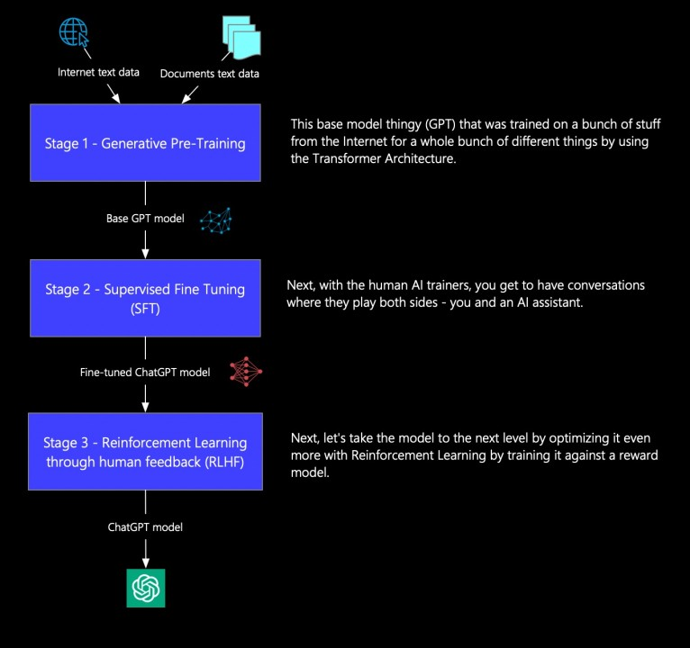

## **How ChatGPT is Trained**

### **Stage 1: Generative Pre-Training**

**Goal**: Teach the model to predict the next word in a sentence using large-scale data from the internet.

**Process**:

* ChatGPT is built on a Transformer-based architecture.
* It is first trained on a massive dataset of text from books, websites, and articles, covering diverse styles and topics.
* The model learns to generate coherent, contextually appropriate text by predicting the next token in a sequence — this is called **unsupervised learning**.

**Challenges**:

* This stage helps the model understand grammar, facts, and some reasoning.
* **However**, it is not aligned with what users expect from a chatbot (like having a conversation or answering specific instructions).
* It’s good at tasks like summarization, translation, and completion, but **not optimized for interactive, human-like dialogue**.

**Outcome**:

* Produces a generalized language model (the base GPT model).
* Still lacks the ability to align outputs with human intent or specific task requirements.

---

### **Stage 2: Supervised Fine-Tuning (SFT)**

**Goal**: Align the model closer to human expectations by teaching it how to respond in conversations.

**Process**:

1. **Human-generated conversations** are created where one human plays the chatbot and the other asks questions.
2. These conversations are converted into **input-output pairs** (prompt + ideal response).
3. The model is fine-tuned on these examples using **Stochastic Gradient Descent (SGD)** to update its parameters.

**Example Tasks Trained**:

* Q\&A
* Chatting
* Following instructions

**Challenges**:

* Still not perfect: After fine-tuning, the model often **drifts** (known as *distributional shift*). It may fail when facing situations outside the fine-tuning data.
* The model only imitates what it has seen — it doesn't evaluate responses for quality or intent.

**Outcome**:

* ChatGPT becomes much better at producing helpful, safe, and aligned responses.
* However, it still needs a mechanism to judge which responses are **best**, which leads to the next stage.

---

### **Stage 3: Reinforcement Learning with Human Feedback (RLHF)**

**Goal**: Refine the model using human preferences to make responses more helpful, safe, and aligned with user intent.

**Process**:

1. ChatGPT generates multiple responses to the same prompt.
2. **Human evaluators** rank these responses from best to worst.
3. A **Reward Model** is trained to assign higher scores to preferred responses using this ranking data.
4. Using **Proximal Policy Optimization (PPO)**, ChatGPT is further trained:

   * The **policy model** (ChatGPT) generates a response.
   * The **reward model** evaluates and scores it.
   * PPO uses these scores to fine-tune the model in small steps.

**Key Concepts**:

* **Reward function**: Based on human rankings; tells the model what’s “good”.
* **Goodhart’s Law**: If you optimize too hard on the reward, the model may exploit weaknesses (e.g., generate good-looking but incorrect answers).
* **KL Divergence Penalty**: Used to prevent the model from straying too far from SFT behavior. Ensures it balances learning from feedback with staying grounded in initial fine-tuning.

**Challenges**:

* If the reward model is flawed, the chatbot can start optimizing for the wrong things.
* Needs careful balance to avoid overfitting to artificial reward metrics.

**Outcome**:

* The model becomes much more helpful, context-aware, and safe for public interaction.
* ChatGPT evolves into a powerful conversational assistant that behaves in human-aligned ways.

---

### **Conclusion**

ChatGPT’s training follows a **three-stage pipeline**:

1. **Pre-training** gives it general language knowledge.
2. **Supervised Fine-Tuning** teaches it to chat like a human.
3. **Reinforcement Learning with Human Feedback** polishes it to prioritize helpfulness, safety, and coherence.

Each stage builds upon the previous one — transforming a basic language model into a smart assistant that feels natural and useful in conversation.

### **Stage 1: Generative Pre-Training**

```mermaid
flowchart TD
    %% Input Section
    A[Internet<br>Huge Input<br>Text Data]:::input --> B[TRANSFORMERS]:::transformer
    B --> C[Base GPT Model]:::base

    %% GPT Model Applications
    C --> D1[Language Translation]:::task
    C --> D2[Text Summarization]:::task
    C --> D3[Text Completion]:::task
    C --> D4[Sentiment Analysis]:::task

    %% Goal Flow
    C --> E[What We Want]:::goal
    E --> F[Conversation]:::conversation
    F --> G[Chatbot]:::chatbot

    %% Styles
    classDef input fill:#87CEEB,stroke:#1E90FF,color:#000,fontWeight:bold;
    classDef transformer fill:#FFD700,stroke:#FFA500,color:#000,fontWeight:bold;
    classDef base fill:#FF69B4,stroke:#C71585,color:#000,fontWeight:bold;
    classDef task fill:#98FB98,stroke:#2E8B57,color:#000,fontWeight:bold;
    classDef goal fill:#FFFACD,stroke:#DAA520,color:#000,fontWeight:bold;
    classDef conversation fill:#FF6347,stroke:#8B0000,color:#fff,fontWeight:bold;
    classDef chatbot fill:#32CD32,stroke:#006400,color:#000,fontWeight:bold;
```

### **Stage 2: Supervised Fine-Tuning (SFT)**

```mermaid
flowchart TD

    %% Stage 1: Human conversations to training corpus
    subgraph Real_Conversations
        H[Human]:::human --> R1[Request 1]:::request
        H --> R2[Request 2]:::request
        H --> R3[Request 3]:::request
        H --> R4[Request 4]:::request

        R1 --> A1["Response 1<br/>(by Human acting like chatbot)"]:::response
        R2 --> A2["Response 2<br/>(by Human)"]:::response
        R3 --> A3["Response 3<br/>(by Human)"]:::response
        R4 --> A4["Response 4<br/>(by Human)"]:::response
    end

    T1["SFT Training<br/>Data Corpus"]:::data
    A1 --> T1
    A2 --> T1
    A3 --> T1
    A4 --> T1

    %% Stage 2: Training GPT model
    T1 --> Q1["Request 1<br/>(Conversation History)"]:::request
    T1 --> Q2["Request 2"]:::request
    T1 --> Q3["Request 3"]:::request

    Q1 --> P1["Ideal Response 1"]:::response
    Q2 --> P2["Response 2"]:::response
    Q3 --> P3["Response 3"]:::response

    subgraph Model_Training
        P1 & P2 & P3 --> M["Base GPT<br/>Model"]:::base
        M --> C["SFT<br/>ChatGPT Model"]:::sft
        M --> Opt["Optimizer:<br/>SGD"]:::optimizer
    end

    %% Styling
    classDef human fill:#FFDDC1,stroke:#FF7F50,color:#000,fontWeight:bold;
    classDef request fill:#B0E0E6,stroke:#4682B4,color:#000,fontWeight:bold;
    classDef response fill:#FFFACD,stroke:#DAA520,color:#000,fontWeight:bold;
    classDef base fill:#FADADD,stroke:#DC143C,color:#000,fontWeight:bold;
    classDef sft fill:#C1E1C1,stroke:#2E8B57,color:#000,fontWeight:bold;
    classDef optimizer fill:#E0FFFF,stroke:#20B2AA,color:#000,fontWeight:bold;
    classDef data fill:#D0F0C0,stroke:#32CD32,color:#000,fontWeight:bold;

```

### **Stage 3 – Reinforcement learning through human Feedback (RLHF)**

